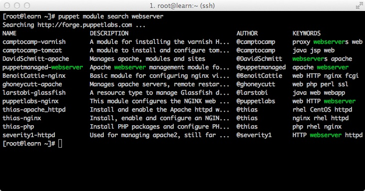
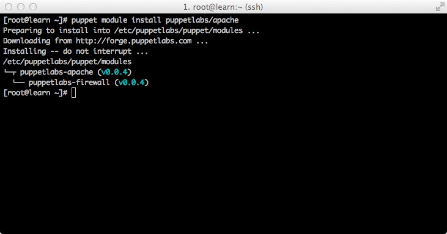
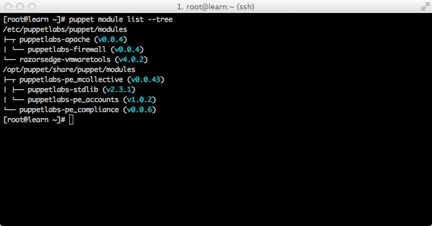

!SLIDE image center 

## Ryan Coleman
## @ryanycoleman
## #puppetcamp

#### This presentation is powered by <a href="https://github.com/schacon/showoff">ShowOff</a>

!SLIDE image center

## 1364 Users
## 435 Modules

!SLIDE

## #puppetize with the Forge

<a href="http://forge.puppetlabs.com/puppetlabs/apt">PuppetLabs/Apt</a>

    @@@ Shell
    $ puppet module install puppetlabs/apt

` `

    @@@ Puppet
    node 'elmo' {

      apt::source { 'puppetlabs':
        location   => 'http://apt.puppetlabs.com',
        repos      => 'main',
        key        => '4BD6EC30',
        key_server => 'pgp.mit.edu',
      }

    }

!SLIDE

## #puppetize with the Forge

<a href="http://forge.puppetlabs.com/saz/sudo">Saz/Sudo</a>

    @@@ Shell
    $ puppet module install saz/sudo

` `

    @@@ Puppet
    node 'oscar' {

      sudo::conf { 'admins':
        priority => 10,
        content  => '%admins ALL=(ALL) NOPASSWD: ALL',
      }

    }

!SLIDE small

## #puppetize with the Forge

<a href="http://forge.puppetlabs.com/puppetlabs/registry">PuppetLabs/Registry</a>

    @@@ Shell
    $ puppet module install puppetlabs/registry

` `

    @@@ Puppet
    node 'beaker' {

      registry_key { 'HKLM\System\CurrentControlSet\Services\Puppet':
        ensure => present,
      }
      registry_value { 'HKLM\System\CurrentControlSet\Services\Puppet\Description':
        ensure => present,
        type   => string,
        data   => "The Puppet Agent service periodically manages your configuration",
      }

    }

!SLIDE

## #puppetize with the Forge

<a href="http://forge.puppetlabs.com/puppetlabs/openstack">PuppetLabs/openstack</a>

    @@@ Shell
    $ puppet module install puppetlabs/openstack

` `

    @@@ Puppet
    node 'kermit' {

      class { 'openstack::all':
        public_address       => '192.168.1.12',
        public_interface     => 'eth0',
        private_interface    => 'eth1',
        admin_email          => 'some_admin@some_company',
        admin_password       => 'admin_password',
        keystone_admin_token => 'keystone_admin_token',
        nova_user_password   => 'nova_user_password',
        glance_user_password => 'glance_user_password',
        rabbit_password      => 'rabbit_password',
        rabbit_user          => 'rabbit_user',
        libvirt_type         => 'kvm',
        fixed_range          => '10.0.0.0/24',
      }

    }

!SLIDE

## #puppetize with the Forge

<a href="http://forge.puppetlabs.com/rtyler/jenkins">RTyler/Jenkins</a>

    @@@ Shell
    $ puppet module install rtyler/jenkins

` `

    @@@ Puppet
    node 'gonzo' {

      class { 'jenkins': }
      jenkins::plugin { 'git': }

    }

!SLIDE

## #puppetize with the Forge

<a href="http://forge.puppetlabs.com/puppetlabs/razor">PuppetLabs/Razor</a>

    @@@ Shell
    $ puppet module install puppetlabs/razor

` `

    @@@ Puppet
    node 'big-bird' {

      class { 'razor':
        ruby_version => '1.8.7',
      }

    }

!SLIDE small

## #puppetize with the Forge

<a href="http://forge.puppetlabs.com/saz/rsyslog">Saz/RSyslog</a>

    @@@ Shell
    $ puppet module install saz/rsyslog

` `

    @@@ Puppet
    node 'cookie-monster' {

      class { 'rsyslog::server':
        enable_tcp                => true,
        enable_udp                => true,
        server_dir                => '/srv/log/',
        custom_config             => undef,
        high_precision_timestamps => false,
      }
      class { 'rsyslog::client':
        log_remote     => true,
        remote_type    => 'tcp',
        log_local      => false,
        log_auth_local => false,
        custom_config  => undef,
        server         => 'cookie-monster',
        port           => '514',
      }

    }

!SLIDE

## #puppetize with the Forge

<a href="http://forge.puppetlabs.com/domcleal/augeasproviders">DomCleal/AugeasProviders</a>

    @@@ Shell
    $ puppet module install domcleal/augeasproviders

` `

    @@@ Puppet
    class 'bar' {

      host { 'example.com':
        ensure   => present,
        ip       => '10.1.2.3',
        provider => 'augeas',
      }
      sshd_config { 'PermitRootLogin':
        value     => 'without-password',
        condition => 'Host example.net',
      }

    }

!SLIDE small

## #puppetize with the Forge

<a href="http://forge.puppetlabs.com/puppetlabs/firewall">PuppetLabs/Firewall</a>

    @@@ Shell
    $ puppet module install puppetlabs/firewall

` `

    @@@ Puppet
    node 'waldorf' {

      firewall { "000 accept all icmp requests":
        proto => "icmp",
        action => "accept",
      }

      firewall { "999 drop all other requests":
        action => "drop",
      }

      firewall { '100 snat for network foo2':
        chain  => 'POSTROUTING',
        jump   => 'MASQUERADE',
        proto  => 'all',
        outiface => "eth0",
        source => ['10.1.2.0/24'],
        table  => 'nat',
      }

    }

!SLIDE

## #puppetize with the Forge

<a href="http://forge.puppetlabs.com/razorsedge/vmwaretools">razorsedge/vmwaretools</a>

    @@@ Shell
    $ puppet module install RazorsEdge/VMWareTools

` `

    @@@ Puppet
    node 'statler' {

      class { 'vmwaretools':
        tools_version => '4.0u3',
        autoupgrade   => true,
      }

    }

!SLIDE

## #puppetize with the Forge

<a href="http://forge.puppetlabs.com/puppetlabs/dism">PuppetLabs/DISM</a>

    @@@ Shell
    $ puppet module install puppetlabs/dism

` `

    @@@ Puppet
    node 'animal' {

      dism { 'NetFx3':
        ensure => present,
      }
      dism { 'IIS-WebServer':
        ensure => present,
        answer => 'C:\answer\iis.xml',
      }

    }

!SLIDE

## #puppetize with the Forge

<a href="http://forge.puppetlabs.com/pdxcat/amanda">PDXCAT/Amanda</a>

    @@@ Shell
    $ puppet module install pdxcat/amanda

` `

    @@@ Puppet
    node 'fozzie' {

      class { 'amanda::client':
        server => 'backup.cat.pdx.edu',
      }
      class { 'amanda::server':
        configs        => [ 'daily', 'archive' ],
        configs_source => 'modules/data/amanda',
      }

    }

!SLIDE smaller

## #puppetize with the Forge

<a href="http://forge.puppetlabs.com/glarizza/haproxy">GLarizza/HAProxy</a>

    @@@ Shell
    $ puppet module install glarizza/haproxy

` `

    @@@ Puppet
    node 'rowlf' {

      class { 'haproxy':
        enable                   => true,
        haproxy_global_options   => ...
        ...
      }

      haproxy::config { 'puppet00':
        order                  => '20',
        virtual_ip             => $::ipaddress,
        virtual_ip_port        => '18140',
        haproxy_config_options => { 'option' => ['tcplog', 'ssl-hello-chk'], 'balance' => 'roundrobin' },
      }

    }

    node 'rizzo' {

      @@haproxy::balancermember { $fqdn:
        order                  => '21',
        listening_service      => 'puppet00',
        server_name            => $::hostname,
        balancer_ip            => $::ipaddress,
        balancer_port          => '8140',
        balancermember_options => 'check'
      }

    }

!SLIDE small

## #puppetize with the Forge

<a href="http://forge.puppetlabs.com/puppetlabs/mysql">PuppetLabs/MySQL</a>

    @@@ Shell
    $ puppet module install puppetlabs/mysql

` `

    @@@ Puppet
    node 'miss_piggy' {

      mysql::db { 'mydb':
        user     => 'myuser',
        password => 'mypass',
        host     => 'localhost',
        grant    => ['all'],
      }

      database { 'mydb':
        charset => 'latin1',
      }
      database_user { 'bob@localhost':
        password_hash => mysql_password('foo')
      }
      database_grant { 'user@localhost/database':
        privileges => ['all'] ,
      }

    }

!SLIDE

## #puppetize with the Forge

## Lots more!

Facts, Functions and Types oh-my!  
<a href="http://forge.puppetlabs.com/puppetlabs/stdlib">PuppetLabs/STDLib</a>

Cloud Provisioners  
<a href="http://forge.puppetlabs.com/puppetlabs/node_gce">PuppetLabs/Node_GCE</a>  

<a href="http://forge.puppetlabs.com/puppetlabs/node_openstack">PuppetLabs/Node_OpenStack</a>  

General Infrastructure  
<a href="http://forge.puppetlabs.com/puppetlabs/puppetlabs/firewall">PuppetLabs/FireWall</a>

<a href="http://forge.puppetlabs.com/puppetlabs/puppetlabs/apache">PuppetLabs/Apache</a>

!SLIDE image center

# Searching For Modules

!SLIDE image center

# Installing Modules

!SLIDE image center

# Listing Installed Modules

!SLIDE small smbullets

# Top Ten Community Authors
1. <a href="http://forge.puppetlabs.com/users/saz">saz</a>
2. <a href="http://forge.puppetlabs.com/users/DavidSchmitt">DavidSchmitt</a>
3. <a href="http://forge.puppetlabs.com/users/dhoppe">dhoppe</a>
4. <a href="http://forge.puppetlabs.com/users/thias">thias</a>
5. <a href="http://forge.puppetlabs.com/users/camptocamp">camptocamp</a>
6. <a href="http://forge.puppetlabs.com/users/mstanislav">mstanislav</a>
7. <a href="http://forge.puppetlabs.com/users/razorsedge">razorsedge</a>
8. <a href="http://forge.puppetlabs.com/users/BenoitCattie">BenoitCattie</a>
9. <a href="http://forge.puppetlabs.com/users/lab42">lab42</a>
10. <a href="http://forge.puppetlabs.com/users/bcarpio">bcarpio</a>

!SLIDE bullets incremental
# Coming Soon To The Forge

* Bug Fixes
* SSL!
* Platform Improvements
* PMT Publishing

!SLIDE bullets incremental

# Focussing On Quality

* Automatic post-publish documentation scraping & linting
* Download Counts
* Ratings & Reviews

!SLIDE bullets incremental
# Things we're thinking about

* More content than just modules
* On-Premise Forge | Private Content
* Module Hack Days & Bounties

!SLIDE bullets

# Be Part Of The Future

* Writing Quality Modules
 * Good Style | Puppet Lint Compliant
 * Real Versioning | SemVer
 * Simple Interfaces
 * Useful Documentation

!SLIDE bullets

# Be Part Of The Future

* Collaboration
 * Find a Forge module you like
 * Try it out / Grab the source-code
 * Talk to the Author / Identify improvement
 * Hack, Submit A Pull, Make a sandwich!

!SLIDE

# Questions?

## @ryanycoleman
## #puppetcamp

### Slides are available, right now.
### http://192.168.232.227 & http://192.168.232.227/pdf

